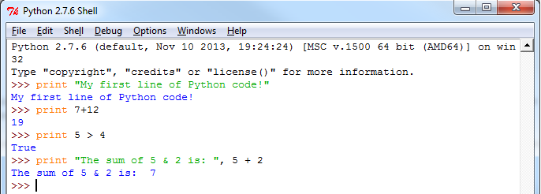
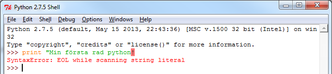

# 1. Bekanta dig med Python & IDLE

## Bakgrund

Python är ett plattformsoberoende, dynamiskt, objektorienterat skriptspråk — lämpligt för såväl prototyputveckling som "tyngre" applikationer (Google, Nasa, Sun Microsystems och Spotify är några av användarna). Det finns tillgängligt för fri nedladdning på [http://python.org/](http://python.org/) och är förinstallerat på Mac OS X, liksom de flesta distributioner av Linux.

Vi kommer i denna kurs att använda oss utav Python 3.x, istället för Python 2.x. Python 2.x används fortfarande utbrett, men eftersom utvecklingen går framåt rör sig allt fler utvecklare mot Python 3.x, varav vi kommer att använda det i denna kurs. Python 2 &amp; 3 liknar varandra väldigt mycket i många aspekter, men Python 3 bröt bakåtkompabilitet vilket gör att en "spricka" har bildats mellan Python 2 &amp; 3.

Den officiella utvecklingsmiljön för Python heter IDLE och följer med installationspaketet. För att köra Python och IDLE behöver vi först installera det.

## Installera Python (egen dator)

Om du sitter vid en egen dator så behöver du installera Python och IDLE. Ni laddar ner Python [här](https://www.python.org), notera att det är <b>versionen 3.7.1</b> som ni ska ladda ner och installera.

## Installera Python (datorsal)

Vi behöver installera Python genom en portabel version (då datorsalarna just nu behöver stödja både version 2 & 3). Ni hittar instruktioner för att installera Python [här](http://www.mah.se/Ar-student/itservice/Vara-tjanster/Studentdatorer/Programvara-i-datorsalar/Portabla-applikationer/). Följ dessa steg för att installera Python på er användare på skolan datorer:

1. [Ladda ner den portabla versionen av Python här](https://sourceforge.net/projects/winpython/files/WinPython_3.5/3.5.2.2/WinPython-64bit-3.5.2.2Zero.exe/download)
2. Installera Python (kör filen du precis laddade ner) på din `M:`-disk (lämpligen skapar du en mapp, t.ex. `Program`, där du installerar det)
3. Starta IDLE

# IDLE - utvecklingsmiljön

När python och IDLE är installerade så ska ni bekanta er med IDLE då det är här som ni kommer att skriva och köra er Python-kod. Börja med att öppna IDLE - då kommer ni att mötas av ett fönster som ser ut såhär:

I IDLE kan man antingen direkt skriva in Python-kod, eller köra Python-kod (eller program) som man sparat i separata filer. För att se så att IDLE fungerar som det ska kan ni börja med att skriva in följande python-kod (föjt av ett enterslag efter varje rad):


print("My first line of Python code!")
print(7+12)
print(5 > 4)
print("The sum of 5 & 2 is: ", 5 + 2)


Har ni skrivit av koden <i>exakt</i> som det står ovan, så borde det se ut på följande sätt:

Skulle ni få upp ett felmeddelande (en röd text, se bild nedan) så har ni antagligen missat en bokstav/tecken någonstans (t.ex. ett citat-tecken). Dubbelkolla då vad ni skrivit in och försök igen (vi kommera att titta mer på felmeddelanden senare).

