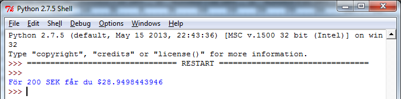
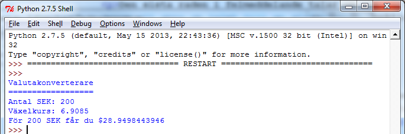

# 5. Ett valutakonverteringsprogram

## Övning

I denna övning ska ni skapa ett program som konverterar kronor till amerikanska dollar. Programmet ska vara uppbyggt så att ni sparar antal svenska kronor i en variabel och valutakursen för dollar i en annan variabeln. Ni ska sedan skriva ut det antal svenska kronor ni vill konvertera, samt hur många dollar detta blir.

När ni fått detta att fungera kan ni snygga till utskriften av beräkningen, t.ex. såhär:

