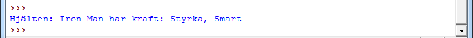
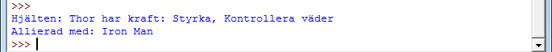
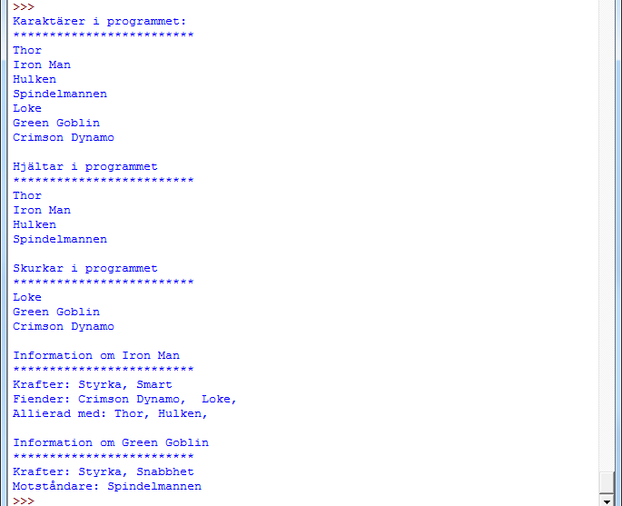

# Inlämningsuppgift 6

## 1. Introduktion

Denna inlämningsuppgift har som syfte att examinera modul 7 som har fokus på arv i objektorienterad programmering.

Inlämningsuppgiften är individuell. Det betyder att studenten enskilt ska utforma och skriva sin inlämning samt kunna redogöra för alla delar av den. Det är så klart inte förbjudet att diskutera uppgiften. Men viktigt är alltså att det man lämnar in representerar ens egna arbete.

## 2. Uppgiftsbeskrivning

Vi ska i denna uppgift skapa ett litet program som hanterar hjältar och skurkar. Både hjältarna och skurkarna ska ha sin egen klass och ska ärva egenskaper och metoder från en karaktärsklass och utöver dessa har egna metoder och egenskaper. Vi ska alltså skapa tre klasser.

1. `Character`
2. `Hero` (ärver från `Character`)
3. `Villain` (ärver från `Character`)

### 2.1. Klassen `Character`

Klassen `Character` ska ha följande egenskaper (med `get` och `set`-metoder):

- `name` - Namnet på karaktären (sträng)
- `power` - De krafter som karaktären har (lista)
- `evil` - Om karaktären än ond eller god (True/False)

Exempelanvändning av klassen `Character` skulle på så vis kunna se ut såhär:


hero = Character("Iron Man", ["Styrka", "Smart"], False)
print hero


### 2.2 Klassen `Hero`

Klassen `Hero` ska ärva alla egenskaper och metoder som klassen  `Character` har. Dessutom ska följande egenskaper finnas:

- `enemy`, en lista på fiender (objekt av klassen `villian`)
- `allies`, en lista på allierade (objekt av klassen `Hero`)

Exemepelanvändning av klassen `Hero` skulle på så vis kunna se ut såhär (vi har inga skurkar att lägga till just nu):


hero = Hero("Thor", ["Styrka", "Kontrollera väder"])
hero2 = Hero("Iron Man", ["Styrka", "Smart"])
hero.add_ally(hero2)
print hero


### 2.2 Klassen `Villian`

Klassen `Villian` ska ärva alla egenskaper och metoder som klassen  `Character` har. Dessutom ska följande egenskaper finnas:

- `antagonist`, en huvudmotståndare (objekt av klassen `Hero`)

Exempelanvändning av klassen `Villian` skulle på så vis kunna se ut såhär:


hero = Hero("Thor", ["Styrka", "Kontrollera väder"])
hero2 = Hero("Iron Man", ["Styrka", "Smart"])
hero.add_ally(hero2)

villian = Villian("Loke", ["Styrka", "Telepati", "Teleport"])
villian.set_antagonist(hero)
print villian


### 2.3. Ytterliggare funktioner

Ni ska nu lägga till några hjältar och skurkar i ert program. Ni kan antingen ta "riktiga" eller hitta på helt egna. Det ert program ska kunna hantera är:

- Kunna lista alla karaktärerna
- Kunna lista alla hjältar/skurkar
- Visa exempel på en hjälte som har minst två allierade och två fiender
- Visa exempel på en skurk som har en huvudfiende.
- Bonus (frivillig), lista alla karaktärer som har viss egenskap
- Bonus (frivillig), göra metoden `kill` för klassen `Character` som ger möjlighet för en karaktär att "döda" en annan (ta bort en karaktär från listan).

I och med att ni ska hantera många karaktärer så ska ni spara dessa i en lista.

## 3. Exempelkörning

## 4. Bedömning

Uppgiften kan ge betyget godkänt. För att nå detta betyg behöver programmet uppfylla uppgiftsbeskrivningen, vara välstrukturerat och väldokumenterat. Extra viktiga punkter är:

- Koden ska vara strukturerad med ett antal funktioner, där varje funktion har begränsat syfte och omfattning
- Koden ska vara tydlig och lättläst med avseende på namngivning, strukturering och kommentarer. Funktioner som inte är självförklarande ska ha en beskrivning i form av _docstrings_ (`''' Kommentar för funktionen '''`-kommentarer).

### 4.1. Specifika krav för uppgiften

- Ni ska använda er utav tre klasser (`Character`, `Hero` och `Villian` där de två senare ärver från klassen `Chraracter`) för att bygga programmets funktionalitet.
- Ni ska inkludera en exempelkörning (skriva en egen) på användandet av era klasser (minimum det som visas under sektionen _exempelkörning_)

## 5. Redovisning

Redovisa genom att ladda upp programmets källkod på It's Learning.

Inlämningsuppgifter rättas varje vecka, med tisdag som rullande deadline. Det betyder: lämna in senast tisdag för rättning samma vecka. Försök att hålla kursens tempo på en modul per vecka. Lämplig inlämningstid för modul 7: senast _torsdag 2014-10-23_.