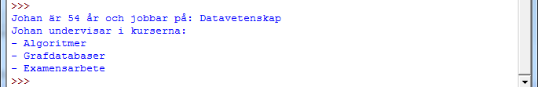
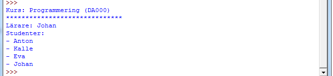

# 1. Introduktion till arv

## Inledning

Vi ska i denna övning introducera oss  i arv i objektorienterad programmering i Python.

### Att använda arv

Arv är smidigt sätt att låta en klass *ärva* (få) egenskaper och metoder av andra klasser. Detta bidrar till ett effektivare sätt att programmera då vi bl.a. inte behöver skriva samma kod två gånger (i de fall där två klasser använder sig av samma egenskaper och funktioner). Vi kommer nu att titta på ett exempel där vi har en huvudklass `Person`, som i sin tur kommer att ha sub-klasserna `Student` och `Professor` som då ärver alla egenskaper och metoder som klassen `Person` har. Eftersom att både en student och en lärare *är* en person kommer de att ha många gemensamma egenskaper, t.ex. namn och ålder. Se följande exempel.

Klassen `Person`:


class Person():

    def __init__(self, name, age):
        self.name = name
        self.age = age

    def get_name(self):
        return self.name

    def get_age(self):
        return self.age

    def __str__(self):
        return "%s är %s år" % (self.name, self.age)

person = Person("Anton", 25)
print person
# Skriver ut: Anton är 25 år


Som ni kan se i exemplet ovan så är egenskaperna (och deras metoder) `name` och `age` för klassen `Person` även aktuella för klasserna `Student` och `Professor`.

Vill vi nu skapa klassen `Student` så vill vi att varje student ska *ärva* de egenskaper och metoder som klassen `Person` har.

Klassen `Student`:


class Student(Person):
    
    def __init__(self, name, age, program):
        Person.__init__(self, name, age)
        self.program = program

student = Student("Anton", 25, "Informationsarkitekt")
print student
# Skriver ut: Anton är 25 år


Detta är grunderna i arv. I exemplet ovan ser vi hur klassen `Student` *ärver* följande från klassen `Person`:

- Egenskap: `name`
- Egenskap: `age`
- Metod: `get_name`
- Metod: `get_age`
- Metod: `__str__`

### Övning 1 - Gör klart klassen `Student`

Som vi kan se i exempelkoden ovan för klassen `Student`, så när vi initierar en instans (en student) så skickar vi även med det program som studenten studerar. Skriv klart klassen `Student` genom att:

1. Lägg till egenskapen `year` som representerar vilket år på utbildningen som studenten går
2. Skapa en ny `__str__`-metod som även skriver ut vilket program studenten studerar (och vilket år)

Resultatet av följande kod: 


student = Student("Anton", 25, "Informationsarkitekt", 2)
print student


Ska bli:

### Övning 2 - Skapa klassen `Professor`

Nu ska vi skapa klassen `Professor` och precis som klassen `Student` ska den ärva de egenskaper och metoder som klassen `Person` har. Utöver de egenskaper och metoder som ärvs ska klassen ha följande:

1. Egenskap: `department`, vilken institution som läraren jobbar vid
2. Egenskap: `courses`, en lista på de kurser som läraren just nu undervisar
3. Metoder för att ange/hämta egenskaperna ovan

En utskrift för koden: 


professor = Professor(...) # Ersätt '...' så att det passar er konstruktor
print professor
print professor.name + " undervisar i kurserna:"
for course in professor.get_courses():
    print "- " + course


Ska bli:

### Övning 3 - Klassen `Course`

Nu ska vi skapa en klass som heter `Course`. Kursen ska bestå utav följande egenskaper:

- `code`, kursens kod
- `title`, titel på kursen
- `professor`, kursens lärare (en instans av klassen `Professor`)
- `students`, en lista på de studenterna som ingår i kursen (instanser av klassen `Student`)

Till detta ska ni skriva funktioner för att:

1. Lägga till kursansvarig för kursen/Hämta kursansvarig
2. Lägga till/Ta bort/Visa studenter
3. En `__str__`funktion som skriver ut information om kursen

Er klass ska fungera med följande kod


professor = Professor("Johan", 54, "Datavetenskap", ["Algoritmer", "Grafdatabaser", "Examensarbete"])
course = Course("DA000", "Programmering")
course.add_professor(professor)
course.add_student(Student("Anton", 25, "Informationsarkitekt", "2"))
course.add_student(Student("Kalle", 22, "Informationsarkitekt", "2"))
course.add_student(Student("Eva", 19, "Informationsarkitekt", "2"))
course.add_student(Student("Johan", 29, "Informationsarkitekt", "2"))
print course


Och utskriften ska se ut något i stil med:

